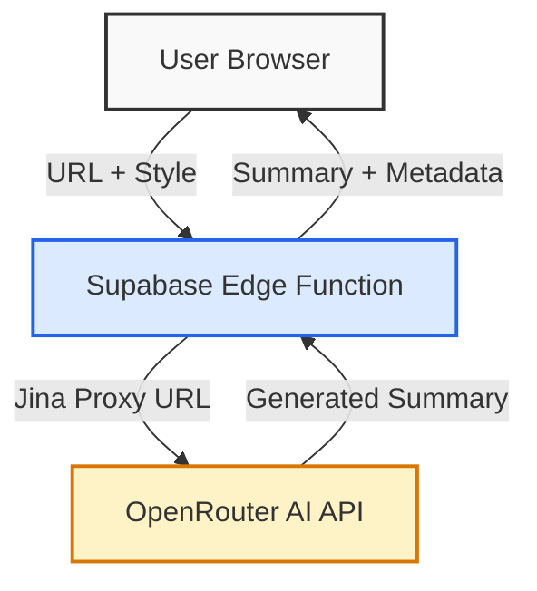
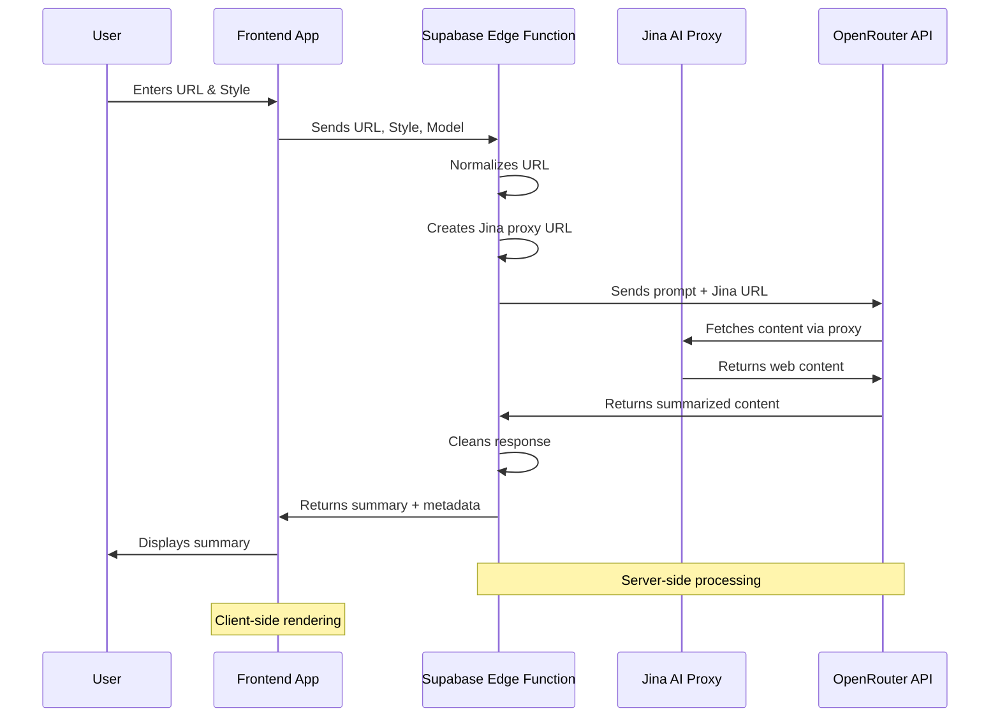
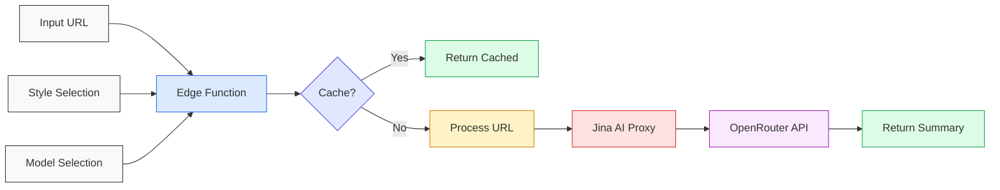

# Distill - Web Content Summarization App

Distill is a web application that extracts and summarizes content from any URL using AI. It offers various summarization styles and formatting options.

## Project info

**URL**: https://lovable.dev/projects/99d45188-0e94-40f1-b1e7-83c5bd06873c

## How It Works

### Architecture Overview

Distill uses a modern edge-based architecture:



### Sequence Diagram



### Data Flow



## Core Technologies

- **Frontend**: React, TypeScript, Tailwind CSS, shadcn/ui
- **Backend**: Supabase Edge Functions
- **Content Extraction**: Jina AI proxy
- **AI Processing**: OpenRouter API (Google Gemini model)
- **Caching**: Edge function caching (1 day TTL)

## Summarization Styles

Distill supports various summarization styles:

- **Standard**: Concise, clear summary of key points
- **Simple**: Easy-to-understand language with short sentences
- **Bullets**: Key points presented as bullet points
- **ELI5**: Explains content as if to a five-year-old
- **Concise**: Ultra-compact summary of essential points
- **Tweet**: Summary in 140 characters or less
- **Clickbait**: Attention-grabbing sensationalist style
- **Custom**: User-defined style with custom parameters

## How can I edit this code?

There are several ways of editing your application.

**Use Lovable**

Simply visit the [Lovable Project](https://lovable.dev/projects/99d45188-0e94-40f1-b1e7-83c5bd06873c) and start prompting.

Changes made via Lovable will be committed automatically to this repo.

**Use your preferred IDE**

If you want to work locally using your own IDE, you can clone this repo and push changes. Pushed changes will also be reflected in Lovable.

The only requirement is having Node.js & npm installed - [install with nvm](https://github.com/nvm-sh/nvm#installing-and-updating)

Follow these steps:

```sh
# Step 1: Clone the repository using the project's Git URL.
git clone <YOUR_GIT_URL>

# Step 2: Navigate to the project directory.
cd <YOUR_PROJECT_NAME>

# Step 3: Install the necessary dependencies.
npm i

# Step 4: Start the development server with auto-reloading and an instant preview.
npm run dev
```

**Edit a file directly in GitHub**

- Navigate to the desired file(s).
- Click the "Edit" button (pencil icon) at the top right of the file view.
- Make your changes and commit the changes.

**Use GitHub Codespaces**

- Navigate to the main page of your repository.
- Click on the "Code" button (green button) near the top right.
- Select the "Codespaces" tab.
- Click on "New codespace" to launch a new Codespace environment.
- Edit files directly within the Codespace and commit and push your changes once you're done.

## What technologies are used for this project?

This project is built with:

- Vite
- TypeScript
- React
- shadcn-ui
- Tailwind CSS

## How can I deploy this project?

Simply open [Lovable](https://lovable.dev/projects/99d45188-0e94-40f1-b1e7-83c5bd06873c) and click on Share -> Publish.

## I want to use a custom domain - is that possible?

We don't support custom domains (yet). If you want to deploy your project under your own domain then we recommend using Netlify. Visit our docs for more details: [Custom domains](https://docs.lovable.dev/tips-tricks/custom-domain/)
