# Project Analysis (2025-12-17)

**Archeology Report Generated:** December 17, 2025  
**Analyst:** Senior React Engineer (SOLID Principles Expert)  
**Analysis Type:** Complete Project Archeology & Technical Assessment

---

## 1. Executive Summary 💡

### Original Vision

Distll was conceived on **March 14, 2025** as an AI-powered URL rewriting service - a "content transformation layer for the web." The project was bootstrapped using **Lovable** (formerly GPT Engineer), an AI-assisted development platform, and iterated through 50+ commits refining the core functionality.

The original goal was elegant: **make any article on the internet readable in any style you want, just by modifying the URL**. No copying, no pasting, no manual work - just prefix any URL with a style modifier and get an AI-rewritten version instantly.

### How to Communicate the Project

#### a) ELI5 (Explain Like I'm 5)

Imagine you have a magic wand that can make any story easier to understand. You wave it at a hard newspaper article and it becomes simple! Or wave it again and the story becomes funny like a joke! Distll is like that magic wand, but for websites. You just type what kind of story you want, and the computer rewrites it for you!

#### b) Elevator Pitch (30 seconds)

**"We transform how people consume content on the web."**

Distll is an AI-powered URL rewriting service that instantly transforms any web article into different reading styles - simplified language, bullet points, executive summaries, or even custom formats like "pirate speak." Instead of copying text into ChatGPT, users just modify the URL pattern. It's frictionless content transformation that makes the entire web more accessible. Perfect for students, professionals, and anyone drowning in information overload.

#### c) Explain to Mom

You know how sometimes you find an interesting article online but it's way too long or complicated? Distll fixes that! Instead of reading a 10-page article, you can see just the important points in 5 bullets. Or maybe you're researching something technical and need it explained simply - Distll can rewrite it like you're explaining to a 5-year-old. It's like having a personal assistant who reads articles for you and gives you the version you actually want. No extra apps, no copying and pasting - just change the web address slightly and boom, you get a better version of the article!

---

## 2. Current State of the Project 🚧

### Functional Status

**Overall Grade:** 🟡 **Partially Functional** (Backend paused, code complete)

#### What Works ✅
- **Frontend (Complete & Polished):**
  - Clean, responsive landing page with URL input
  - Pre-made style buttons (simple, eli5, clickbait, tamil, executivesummary, bullets)
  - Custom style text input for any transformation
  - URL-based routing (e.g., `distll.com/simple/nytimes.com/article`)
  - Loading states with progress indicators
  - Sophisticated error handling with categorized error messages
  - Settings panel (model selection, API configuration)
  - Minimal content display with clean typography
  
- **Backend Architecture (Code Complete):**
  - Supabase Edge Function (`process-url`) fully implemented
  - Deno-based serverless function with proper CORS
  - Jina AI integration for clean content extraction
  - OpenRouter API integration for AI summarization
  - Hardcoded fallback API key for immediate use
  - Robust error handling and timeout management
  - Modular service architecture (contentProcessor, aiService, contentFetcher, promptService)

#### What's Broken ❌
- **Supabase Backend:** Project paused due to inactivity on free tier
  - The Edge Function code is complete but unreachable
  - Frontend can't access the summarization service
  - **Impact:** App is non-functional end-to-end

#### What's Incomplete ⚠️
- **No Database:** Never implemented (actually a feature - stateless design)
- **No User Accounts:** No authentication system (by design)
- **No Usage Analytics:** Can't track user patterns or popular styles
- **No Rate Limiting:** Vulnerable to API abuse
- **No Caching:** Same URL+style combination hits AI API every time
- **No Error Tracking:** No Sentry or logging service integration

### Brutally Honest Assessment

**The Good:**
- Clean, well-structured codebase following React best practices
- Proper separation of concerns (hooks, services, components)
- Type-safe TypeScript throughout
- Excellent error handling UX
- URL-based routing is clever and user-friendly
- No unnecessary complexity - YAGNI principle applied well

**The Concerning:**
- Zero automated tests (no unit tests, no integration tests, no E2E tests)
- No CI/CD pipeline
- Hardcoded API key in public Edge Function code (security risk)
- Single point of failure (Jina AI proxy)
- No monitoring or observability
- No consideration for cost at scale (every request = paid AI API call)
- React 18 when React 19 is stable (outdated within months of creation)

**The Ugly Truth:**
- Created via AI assistance (Lovable) without manual code review depth
- No git branching strategy - direct commits to main
- Original developer may not understand the full architecture
- Project's current non-functional state suggests abandonment or pause

---

## 3. Act as a Technical Cofounder 🤝

### Challenging Assumptions

**Q1: Why no caching?**
The current implementation hits the AI API for EVERY request, even for duplicate URL+style combinations. This is expensive and slow. A simple Redis or KV cache with 24-hour TTL would save 80%+ of API costs for popular articles.

**Recommended:** Implement edge caching (Cloudflare KV, Deno KV, or simple in-memory cache for same session)

**Q2: Why hardcode the API key in the Edge Function?**
The code says it's a "$5 limit public key" but this is exposed in the repository. Anyone can fork the repo, find the key, and burn through that $5 in minutes. Then the service dies for everyone.

**Recommended:** Store API key as environment variable/secret, even if it's a throwaway key. Add rate limiting per IP.

**Q3: Why Supabase if you're not using the database?**
The project uses Supabase purely for Edge Functions. That's like buying a Swiss Army knife to use only the toothpick. Better platforms exist for just hosting serverless functions (Deno Deploy, Cloudflare Workers, Netlify Edge Functions).

**Recommended:** Migrate to Deno Deploy (see MIGRATION_ANALYSIS.md)

**Q4: Is the core UX pattern actually good?**
URL manipulation like `distll.com/eli5/example.com/article` is clever BUT:
- Users must understand URL encoding
- Breaks on URLs with special characters
- Not discoverable (users won't guess this pattern)
- No SEO value (each article creates a unique URL)

**Alternative Approach:** Consider a browser extension or bookmarklet that works on the current page. Or a simple paste-URL interface with shareable result links.

### Warning About Pitfalls

🚨 **Security:**
- Arbitrary URL fetching is an SSRF vulnerability risk
- No input sanitization on custom styles (prompt injection possible)
- No rate limiting = API cost bomb waiting to happen

🚨 **Scalability:**
- No caching = every popular article hits AI API repeatedly
- Free tier edge function limits will be hit quickly with any traffic
- OpenRouter free model quota can be exhausted by a single motivated user

🚨 **Technical Debt:**
- Zero tests means refactoring is risky
- Dependency versions already outdated
- No error monitoring = flying blind in production

### Creative Alternatives & Improvements

**Immediate Low-Hanging Fruit:**
1. **Add Simple Caching:**
   ```typescript
   const cacheKey = `${url}:${style}:${bulletCount}`;
   // Check cache first, return if hit
   // Only call AI API on cache miss
   ```

2. **Implement Rate Limiting:**
   - Use IP-based throttling (10 requests/hour per IP)
   - Add captcha after 3 requests
   - Consider API key requirement for heavy users

3. **Add Basic Analytics:**
   - Track popular URLs and styles
   - Monitor error rates by error type
   - A/B test different AI models for cost/quality tradeoff

**Strategic Improvements:**

1. **Browser Extension:**
   - Right-click any article → "Simplify with Distll"
   - No URL manipulation needed
   - Better user experience
   - Monetization path (premium features)

2. **Result Caching & Sharing:**
   - Generate short links for summaries
   - Allow sharing/bookmarking results
   - Build SEO value with cached summaries
   - Reduce API costs dramatically

3. **Multi-Model Support:**
   - Default to free Gemini model
   - Offer Claude/GPT for premium results
   - Let users compare outputs
   - Tiered pricing model

4. **Quality Improvements:**
   - Add source verification (fact-check warnings)
   - Extract and preserve article metadata (author, date, source)
   - Add "citation mode" that includes sources in summary
   - Support academic paper summarization with proper citations

### Hard Questions

**Q:** Why was this built with Lovable (AI-assisted) instead of manually?
**A:** Faster prototyping, but at what cost? The codebase is clean but lacks strategic thinking about caching, monitoring, and cost management. An experienced developer would have spotted these gaps.

**Q:** Could this scale to 1000 users/day?
**A:** No. With no caching and free tier limits, the service would either hit rate limits or rack up AI API costs. Needs architectural changes first.

**Q:** What's the moat?
**A:** Currently none. The "URL manipulation" UX is novel but easily replicated. The value is in execution, caching strategy, and quality of prompts - none of which are protected.

**Q:** Is this a product or a weekend project?
**A:** Structurally it's a weekend project that could become a product. Needs: authentication, paid tiers, caching, analytics, and consistent execution.

---

## 4. Technology Stack & Modernization Analysis 🛠️

### a) Gap Analysis

**Original Vision vs Current State**

| Feature | Planned | Implemented | Gap | Severity |
|:--------|:--------|:------------|:----|:---------|
| URL Summarization | ✅ | ✅ | None | - |
| Multiple Styles | ✅ | ✅ | None | - |
| Custom Styles | ✅ | ✅ | None | - |
| User Accounts | ❌ | ❌ | Design choice (stateless) | 🟢 Low |
| Usage Analytics | ❓ | ❌ | No tracking | 🟡 Medium |
| Rate Limiting | ❓ | ❌ | Security risk | 🔴 High |
| Caching | ❓ | ❌ | Cost risk | 🔴 High |
| Error Monitoring | ❓ | ❌ | Operational blindness | 🟡 Medium |
| Automated Tests | ❓ | ❌ | Technical debt | 🔴 High |
| Mobile App | ❌ | ❌ | Not planned | 🟢 Low |
| Browser Extension | ❌ | ❌ | Missed opportunity | 🟡 Medium |

**Abandoned Initiatives:**
- None identified - the project has consistent focus on core URL summarization

**What Worked:**
- ✅ Clean separation of concerns (React hooks, service layer, Edge Functions)
- ✅ Type safety with TypeScript
- ✅ Component-driven design with shadcn/ui
- ✅ Serverless architecture (low operational overhead)

**What Didn't Work:**
- ❌ Supabase free tier pausing (chose wrong platform for use case)
- ❌ No test coverage from day one (AI-generated code assumption)
- ❌ Hardcoded secrets (security oversights)

### b) Project Recreation Prompt (400 words)

**COMPREHENSIVE PROJECT RECREATION PROMPT:**

Create a modern web application called "Distll" - an AI-powered content transformation service that allows users to instantly rewrite any web article in different styles. The core user experience should be frictionless: users paste a URL or modify the web address with a style prefix, and receive an AI-generated summary/rewrite within seconds.

**Core Functionality:**
1. **URL Input & Processing:** Accept URLs via a clean landing page input field OR via URL routing pattern (e.g., `app.com/simple/example.com/article`)
2. **Style Selection:** Provide pre-made style buttons (simple, eli5, clickbait, bullets, executivesummary) and a custom style text input for user-defined transformations
3. **Content Extraction:** Use Jina AI Reader API (`r.jina.ai/[url]`) to fetch clean article text from any URL, avoiding HTML parsing complexity
4. **AI Summarization:** Send extracted content to OpenRouter API (using Google Gemini 2.0 Flash free tier model) with style-specific prompts
5. **Result Display:** Show the rewritten content in a minimal, readable format with proper loading states and error handling

**Technical Requirements:**
- Frontend: React 19+ with TypeScript, Vite 7+ build tool, TailwindCSS for styling
- UI Components: shadcn/ui for consistent design system
- State Management: React Query for async state, Context API for settings
- Backend: Serverless edge function (Deno Deploy or Cloudflare Workers) for processing
- External APIs: Jina AI Reader (free), OpenRouter AI (Gemini free tier)
- No database required (stateless architecture)
- No authentication (public service for MVP)

**Architecture Patterns Worth Preserving:**
- Service layer pattern: separate `edgeFunctionService.ts` for API calls
- Custom React hooks: `useContentProcessor` encapsulating processing logic
- Error categorization: typed error codes (URL_ERROR, CONNECTION_ERROR, CONTENT_ERROR, AI_SERVICE_ERROR)
- Modular Edge Function: split into contentFetcher, contentProcessor, aiService, promptService

**Modern Improvements to Incorporate:**
- **Caching:** Implement edge KV caching for duplicate URL+style requests (24-hour TTL)
- **Rate Limiting:** IP-based throttling (10 requests/hour) to prevent abuse
- **

Monitoring:** Integrate error tracking (Sentry) and basic analytics (Plausible or Vercel Analytics)
- **Testing:** Write unit tests for prompt generation, integration tests for Edge Function, E2E tests for user flows
- **Security:** Environment variables for all API keys, input sanitization for custom styles, CORS properly configured
- **Performance:** Streaming responses from AI API, optimistic UI updates, skeleton loaders
- **SEO:** Generate shareable result pages with unique URLs and meta tags

**Essential Third-Party Integrations:**
- Jina AI Reader: `https://r.jina.ai/` for content extraction
- OpenRouter API: `https://openrouter.ai/api/v1/chat/completions` for AI
- Edge KV Store: Cloudflare KV, Deno KV, or Vercel KV for caching

**User Experience Priorities:**
- Sub-3-second response time (with caching)
- Mobile-responsive design
- Clear error messages with recovery suggestions
- Progress indicators during processing
- Copy-to-clipboard functionality for results

**Performance & Scalability Requirements:**
- Handle 1000 requests/day within free tier limits
- Cache hit rate >70% for popular articles
- Error rate <2%
- Edge deployment for low-latency global access
- Graceful degradation if AI API is down

### c) Future-Proof Summary

**Critical Takeaway:** Distll is a well-executed MVP of a content transformation service that validates the core concept but lacks production-grade infrastructure (caching, monitoring, rate limiting, tests). To scale beyond a demo, prioritize: (1) migrating to Deno Deploy for reliability, (2) implementing KV caching to reduce AI costs by 70%+, and (3) adding rate limiting to prevent abuse. The codebase is maintainable and type-safe but will require dependency updates and test coverage before serious investment.

### d) Continuation Roadmap

#### Quick Wins (< 1 week)

1. **Migrate to Deno Deploy** (2 hours)
   - Deploy Edge Function to Deno Deploy
   - Update frontend to new endpoint
   - Zero code changes needed
   - **Impact:** Service functional again

2. **Add Basic Caching** (4 hours)
   - Implement Deno KV caching
   - Cache key: `${url}:${style}:${bulletCount}`
   - 24-hour TTL
   - **Impact:** 70-80% cost reduction

3. **Fix Security: Environment Variables** (1 hour)
   - Move API key to Deno Deploy secrets
   - Add fallback to hardcoded key for testing
   - **Impact:** Prevent API key theft

4. **Add Rate Limiting** (3 hours)
   - IP-based throttling via Deno KV
   - 10 requests/hour per IP
   - Return 429 with retry-after header
   - **Impact:** Prevent abuse

#### Medium-term (1-4 weeks)

1. **Add Error Monitoring** (4 hours)
   - Integrate Tiny bird or simple logging
   - Track error rates by type
   - Set up alerts for >5% error rate

2. **Write Core Tests** (1 week)
   - Unit tests for `useContentProcessor`
   - Integration tests for Edge Function
   - E2E test for happy path
   - **Coverage goal:** 50%+

3. **Implement Result Sharing** (1 week)
   - Generate short links for summaries
   - Store cached results in KV
   - Add social meta tags
   - **Impact:** SEO value, reduced API costs

4. **Dependency Upgrade** (1 week)
   - Upgrade React 18 → 19
   - Upgrade Vite 5 → 7
   - Upgrade React Router 6 → 7
   - Test thoroughly

#### Long-term (> 1 month)

1. **Browser Extension** (2-3 weeks)
   - Chrome/Firefox extension
   - Right-click context menu integration
   - Popup UI for style selection
   - **Impact:** Better UX, viral growth

2. **Authentication & User Accounts** (3-4 weeks)
   - Add Clerk or Auth0 integration
   - User dashboard with history
   - Save favorite styles
   - API usage tracking

3. **Premium Tier** (2-3 weeks)
   - Stripe integration
   - Premium AI models (Claude, GPT-4)
   - Higher rate limits
   - Priority support

4. **Multi-Language Support** (2 weeks)
   - i18n setup
   - Translate UI to Spanish, French, German
   - Language-specific prompts

#### Pitfalls to Avoid

❌ **Don't:** Add features before fixing infrastructure (caching, monitoring, tests)  
✅ **Do:** Build solid foundation first

❌ **Don't:** Stay on React 18 + outdated dependencies  
✅ **Do:** Schedule quarterly dependency reviews

❌ **Don't:** Ignore security (rate limiting, API keys)  
✅ **Do:** Treat security as P0 from day one

❌ **Don't:** Optimize prematurely (complex caching strategies)  
✅ **Do:** Start with simple KV cache, measure, then optimize

❌ **Don't:** Build a mobile app before validating product-market fit  
✅ **Do:** Focus on web first, extension second, mobile last

### e) Last 5 Significant Updates 📜

Analyzed git history for meaningful commits (excluding trivial fixes):

**Commit 1:** `b7cbebb7b30b47bc47db7da2e05bca3da80ed34f` - 2025-03-28  
**Summary:** Added custom branding assets (og-image.png upload)  
**Impact:** Minor - improved social sharing preview image

**Commit 2:** `6db0651f2e5423275b3436ae8aff26bff54298d1` - 2025-03-24  
**Summary:** Refactored URL-based summarization to support style prefixes in path  
**Impact:** Major - enabled core UX pattern `distll.com/style/url`

**Commit 3:** `c5a027883743a522542e7246b93394850e7ae0cf` - 2025-03-24  
**Summary:** Removed fixed summarization styles from UI, made fully dynamic  
**Impact:** Moderate - simplified codebase, made custom styles first-class

**Commit 4:** `f3035a0dc77047bd8cd8e314e46ed96cd7fa2624` - 2025-03-24  
**Summary:** Added architecture documentation with diagrams to README  
**Impact:** High - improved project understanding, though now outdated

**Commit 5:** `017240fbb154447ac3aa88f50c6faf4e91438dcc` - 2025-03-24  
**Summary:** Hardcoded fallback API key in Edge Function for public use  
**Impact:** Critical - enabled immediate functionality but introduced security risk

**Overall Trajectory:** The commits show iterative refinement of the URL-based UX pattern, with increasing focus on making custom styles flexible. Security considerations (hardcoded API key) were deprioritized for speed. Last manual commit was March 28 (8.5 months ago), suggesting project is dormant or paused.

### f) Architecture & Platform Analysis

**Platform Identification:** 🌐 **Web Application (SPA)**

**Tech Stack:**
- **Frontend Framework:** React 18.3.1 (released April 2024)
- **Build Tool:** Vite 5.4.1 (released August 2024)
- **Language:** TypeScript 5.5.3 (released June 2024)
- **Styling:** TailwindCSS 3.4.11
- **UI Components:** shadcn/ui (Radix UI primitives)
- **Routing:** React Router DOM 6.26.2
- **State Management:** @tanstack/react-query 5.56.2, React Context API
- **Backend Runtime:** Deno (Supabase Edge Functions)
- **Deployment Target:** Static hosting (frontend) + Serverless edge (backend)

**Design Patterns Identified:**

1. **Service Layer Pattern:**
   - `edgeFunctionService.ts` - API communication
   - `aiService.ts` - OpenRouter integration
   - `contentFetcher.ts` - Jina AI integration
   - Clean separation of concerns

2. **Custom Hooks Pattern:**
   - `useContentProcessor` - Main processing logic
   - `useSettings` - Settings context consumer
   - Encapsulates stateful logic

3. **Context Pattern:**
   - `SettingsContext` - Global settings state
   - Settings persistence to localStorage

4. **Error Boundary Pattern:**
   - Typed error codes (ErrorCodeType)
   - Categorized error handling (URL_ERROR, CONNECTION_ERROR, etc.)
   - User-friendly error messages

5. **Composition Pattern:**
   - Small, focused components
   - `MinimalContentView`, `ErrorDisplay`, UI primitives
   - Promotes reusability

**Component Structure & Data Flow:**

```
App (Router)
├── Index (Landing Page)
│   ├── URL Input Form
│   ├── Style Buttons
│   ├── Custom Style Input
│   └── Navigation → /[style]/[url]
│
└── Distill (Processing Page)
    ├── useContentProcessor Hook
    │   ├── Extract URL from path
    │   ├── Call Edge Function via edgeFunctionService
    │   └── Handle loading/error states
    │
    └── MinimalContentView
        ├── Loading State (Progress Bar)
        ├── Error Display (Categorized Errors)
        └── Summary Display (Markdown + Copy Button)

Settings Context (Global)
└── Stores: model selection, API config
```

**Data Flow:**
1. User enters URL + selects style → Index component
2. Navigate to `/[style]/[url]` → React Router
3. Distill component mounts → useContentProcessor hook
4. Hook calls `invokeProcessFunction` → edgeFunctionService
5. Edge Function: fetch content (Jina) → pass to AI (OpenRouter) → return summary
6. Hook updates state → MinimalContentView renders result

### g) Visual System Overview


### h) Visual Architecture & Flow Diagrams 🎨

#### System Architecture Diagram

```mermaid
graph TD
    subgraph "Client Layer"
        Browser[Web Browser]
        Mobile[Mobile Browser]
    end
    
    subgraph "Frontend - React SPA"
        Router[React Router DOM 6.26.2]
        IndexPage[Index.tsx<br/>Landing Page]
        DistillPage[Distill.tsx<br/>Processing Page]
        
        Hooks[Custom Hooks Layer]
        UseProcessor[useContentProcessor<br/>Main Processing Logic]
        UseSettings[useSettings Context]
        
        Services[Service Layer]
        EdgeFuncService[edgeFunctionService.ts<br/>API Client]
    end
    
    subgraph "Backend - Deno Edge Function"
        EdgeEntry[index.ts<br/>Entry Point]
        ContentProc[contentProcessor.ts<br/>URL Processing]
        ContentFetch[contentFetcher.ts<br/>HTTP Client]
        AIService[aiService.ts<br/>OpenRouter Integration]
        PromptService[promptService.ts<br/>Prompt Templates]
    end
    
    subgraph "External Services"
        JinaProxy["Jina AI Reader<br/>r.jina.ai<br/>(Content Extraction)"]
        OpenRouterAPI["OpenRouter API<br/>openrouter.ai<br/>(AI Summarization)"]
        GeminiModel["Google Gemini 2.0<br/>Flash Thinking Exp<br/>(Free Tier Model)"]
    end
    
    subgraph "Infrastructure"
        SupabaseOld["Supabase Edge Functions<br/>(PAUSED ❌)"]
        DenoDeployNew["Deno Deploy<br/>(Recommended ✅)"]
        StaticHost["Static Hosting<br/>Netlify/Vercel"]
    end
    
    Browser --> Router
    Mobile --> Router
    Router --> IndexPage
    Router --> DistillPage
    
    DistillPage --> UseProcessor
    IndexPage --> UseSettings
    DistillPage --> UseSettings
    
    UseProcessor --> EdgeFuncService
    
    EdgeFuncService -.CORS POST.-> EdgeEntry
    
    EdgeEntry --> ContentProc
    ContentProc --> ContentFetch
    ContentProc --> AIService
    AIService --> PromptService
    
    ContentFetch -.HTTP GET.-> JinaProxy
    JinaProxy -.Clean Text.-> ContentFetch
    
    AIService -.HTTP POST.-> OpenRouterAPI
    OpenRouterAPI --> GeminiModel
    GeminiModel -.Summary.-> OpenRouterAPI
    OpenRouterAPI -.JSON.-> AIService
    
    EdgeFuncService -.Deployed on.-> SupabaseOld
    EdgeFuncService -.Should migrate to.-> DenoDeployNew
    
    IndexPage -.Built static.-> StaticHost
    DistillPage -.Built static.-> StaticHost
    
    style SupabaseOld fill:#ff6b6b,stroke:#d32f2f,color:#fff
    style DenoDeployNew fill:#4caf50,stroke:#388e3c,color:#fff
    style JinaProxy fill:#ffb74d
    style OpenRouterAPI fill:#64b5f6
    style GeminiModel fill:#ba68c8
```



#### User Journey / UX Flow Diagram


#### Sequence Diagram - Request Flow

```mermaid
sequenceDiagram
    actor User
    participant Frontend as React Frontend
    participant Hook as useContentProcessor
    participant Service as edgeFunctionService
    participant Edge as Deno Edge Function
    participant Jina as Jina AI Reader
    participant OpenRouter as OpenRouter API
    participant Gemini as Gemini 2.0 Model
    
    User->>Frontend: Enter URL + Select "simple" style
    Frontend->>Frontend: Navigate to /simple/nytimes.com/article
    Note over Frontend: URL pattern triggers Distill page
    
    Frontend->>Hook: Mount Distill component
    Hook->>Hook: Extract URL & style from path
    Hook->>Service: invokeProcessFunction({url, style})
    
    Service->>Edge: POST /process-url
    Note over Service,Edge: {url: "nytimes.com/...", style: "simple"}
    
    Edge->>Jina: GET https://r.jina.ai/nytimes.com/...
    Note over Edge,Jina: Jina extracts clean article text
    Jina-->>Edge: Clean text (no HTML, ads, scripts)
    
    Edge->>Edge: Build prompt using style="simple"
    Edge->>OpenRouter: POST /chat/completions
    Note over Edge,OpenRouter: {model: "gemini-2.0-flash", messages: [...]}
    
    OpenRouter->>Gemini: Forward request to Gemini model
    Gemini-->>OpenRouter: AI-generated summary
    OpenRouter-->>Edge: {choices: [{message: {content: "..."}}]}
    
    Edge->>Edge: Extract & clean summary text
    Edge-->>Service: {originalContent, summary}
    
    Service-->>Hook: Success response
    Hook->>Hook: Update state: setSummary(data.summary)
    Hook-->>Frontend: Render summary in MinimalContentView
    
    Frontend-->>User: Display simplified article
    User->>Frontend: Click "Copy" button
    Frontend-->>User: Summary copied to clipboard ✓
```



#### Data Model Diagram


**Note on Data Architecture:** This project intentionally has no database. All state is ephemeral or client-side (localStorage). Each request is processed independently with no session persistence. This is a design choice for simplicity but limits features like user history, caching server-side, or analytics.

### i) Migration Feasibility Summary

**Complexity:** 🟡 Medium-Low (1-4 hours depending on platform)

**Recommendation:** Migrate to **Deno Deploy** for zero code changes and better free tier limits.

See comprehensive analysis: **[MIGRATION_ANALYSIS.md](./MIGRATION_ANALYSIS.md)**

**Key Points:**
- ✅ No database to migrate (stateless architecture)
- ✅ Deno code is portable across edge platforms
- ✅ Frontend is platform-agnostic (static SPA)
- ⚠️ Platform choice impacts developer experience and cost scaling

**Quick Comparison:**

| Platform | Code Changes | Migration Time | Free Tier | Recommendation |
|:---------|:-------------|:--------------|:----------|:---------------|
| Deno Deploy | None | 1-2 hours | 1M req, 20 CPU hrs | ⭐ **Best** |
| Netlify Edge | Minimal wrapper | 3-4 hours | 1M invocations | 🔶 Good |
| Cloudflare Workers | Significant rewrite | 6-12 hours | ~3M req/month | ⚠️ Overkill |
| New Supabase | Environment config | 30 mins | 500k invocations | ⚠️ Same pause risk |

---

## 5. Technology Stack & Modernization Table 🛠️

**Version Audit as of December 17, 2025:**

| Technology | Version Used | Latest Stable (2025-12-17) | Gap Analysis & Security Notes |
|:-----------|:-------------|:---------------------------|:------------------------------|
| **Core Framework** ||||
| React | 18.3.1 | **19.2.3** | 🔴 **1 major version behind**. React 19 released Dec 2024 with React Compiler, Server Components, Actions. Breaking changes in hooks and refs. Migration guide needed. |
| React DOM | 18.3.1 | **19.2.3** | 🔴 Must upgrade with React core. |
| TypeScript | 5.5.3 | **5.9.3** | 🟡 **4 minor versions behind**. Consider upgrade for new ECMAScript features and performance improvements. No breaking changes expected. |
| **Build Tools** ||||
| Vite | 5.4.1 | **7.3.0** | 🔴 **2 major versions behind** (5 → 6 → 7). Vite 6 had breaking changes, Vite 7 released Dec 2025. Performance improvements and API changes. |
| **Routing & State** ||||
| React Router DOM | 6.26.2 | **7.10.1** | 🔴 **1 major version behind**. React Router 7 released Nov 2024 with data loading changes, new API. Migration effort required. |
| @tanstack/react-query | 5.56.2 | **5.90.12** | 🟢 Minor versions behind. Safe to upgrade incrementally. |
| **UI Framework** ||||
| TailwindCSS | 3.4.11 | **3.4.17** (v4 in beta) | 🟢 Up to date for v3. Tailwind v4 in beta - consider when stable. |
| @radix-ui/* (various) | 1.x - 2.x | Latest per package | 🟢 All Radix packages up to date or within 1 minor version. |
| lucide-react | 0.462.0 | **0.561.0** | 🟡 ~99 versions behind (icon library, low risk). |
| shadcn/ui components | N/A (copy-paste) | Latest templates | 🟢 Components manually copied, not versioned dependency. |
| **Backend** ||||
| @supabase/supabase-js | 2.49.1 | **2.88.0** | 🟡 **39 minor versions behind**. Should upgrade for bug fixes and new features. Check changelog for breaking changes. |
| Deno (Edge Function) | ~1.x (Supabase runtime) | **2.1.x** | 🟡 Runtime version controlled by platform. Deno 2.0 released Oct 2024 with npm compatibility improvements. |
| **Utilities** ||||
| date-fns | 3.6.0 | **4.1.0** | 🟡 **1 major version behind**. Tree-shaking improvements in v4. |
| zod | 3.23.8 | **4.2.1** | 🔴 **1 major version behind**. Zod 4.0 released with performance improvements and API changes. |
| sonner (toasts) | 1.5.0 | **2.0.7** | 🟡 **1 major version behind**. Check migration guide for breaking changes. |
| tailwind-merge | 2.5.2 | **3.4.0** | 🟡 **1 major version behind**. |
| **Security & Dependencies** ||||
| ESLint | 9.9.0 | **9.18.x** | 🟢 Minor updates available. |
| TypeScript ESLint | 8.0.1 | **9.x** | 🟡 **1 major version behind**. |

### Critical Security & EOL Warnings

🔴 **HIGH PRIORITY:**
1. **React 18 → 19:** React 18 will eventually fall out of support. React 19 is production-ready as of Dec 2024.
2. **Vite 5 → 7:** Staying 2 majors behind means missing security patches and performance gains. Vite has excellent migration docs.
3. **React Router 6 → 7:** API changes require code updates, but worth it for better data loading patterns.

🟡 **MEDIUM PRIORITY:**
4. **Supabase JS Client:** 39 minor versions behind - likely has accumulated bug fixes and security patches.
5. **Zod 3 → 4:** Validation library needs major upgrade. Check for schema breaking changes.
6. **date-fns 3 → 4:** Tree-shaking improvements could reduce bundle size.

🟢 **LOW PRIORITY:**
7. **Icon libraries (lucide-react):** 99 versions behind but icons are low-risk. Update when convenient.
8. **Minor version upgrades:** TypeScript, Tailwind, various Radix UI components are close to latest.

### Dependency Health Status

| Category | Status | Action Required |
|:---------|:-------|:----------------|
| Major frameworks | 🔴 Outdated | Plan upgrade sprint |
| Build tools | 🔴 Outdated | Upgrade Vite with caution |
| UI components | 🟢 Healthy | Minor updates only |
| Utilities | 🟡 Mixed | Review changelogs, selective upgrade |
| DevDependencies | 🟢 Healthy | Keep updated quarterly |

### Recommended Upgrade Path

**Phase 1 (Low Risk - Week 1):**
1. ✅ Install dependencies: `npm install`
2. Upgrade minor versions within current major:
   - `npm update --save` (respects semver ranges)
3. Update icon library: `lucide-react@latest`
4. Update Radix UI components (mostly patch/minor)

**Phase 2 (Medium Risk - Weeks 2-3):**
1. Upgrade Vite 5 → 6 → 7 (follow Vite migration guides)
2. Update TypeScript 5.5 → 5.9 (low breaking change risk)
3. Update Supabase client 2.49 → 2.88 (check changelog)
4. Run full test suite (oh wait, there are no tests 😬)

**Phase 3 (High Risk - Weeks 4-6):**
1. Upgrade React 18 → 19 (read migration guide carefully)
   - Test hooks, refs, Suspense behavior
   - Check for deprecated APIs
2. Upgrade React Router 6 → 7 (data loading API changes)
3. Upgrade Zod 3 → 4 (validation schemas)
4. Upgrade date-fns 3 → 4 (breaking API changes possible)
5. Full regression testing required

**Testing Strategy (since none exists):**
- [ ] Create smoke test script before upgrades
- [ ] Test critical paths: URL input → processing → display
- [ ] Test error scenarios (invalid URL, API errors)
- [ ] Visual regression testing (Percy, Chromatic, or manual)
- [ ] Performance benchmarking before/after

---

## Previous README Versions

- [Original README before 2025-12-17 analysis](../../blob/b7cbebb7b30b47bc47db7da2e05bca3da80ed34f/README.md)

---

# Welcome to your Lovable project

## Project info

**URL**: https://lovable.dev/projects/99d45188-0e94-40f1-b1e7-83c5bd06873c

## How can I edit this code?

There are several ways of editing your application.

**Use Lovable**

Simply visit the [Lovable Project](https://lovable.dev/projects/99d45188-0e94-40f1-b1e7-83c5bd06873c) and start prompting.

Changes made via Lovable will be committed automatically to this repo.

**Use your preferred IDE**

If you want to work locally using your own IDE, you can clone this repo and push changes. Pushed changes will also be reflected in Lovable.

The only requirement is having Node.js & npm installed - [install with nvm](https://github.com/nvm-sh/nvm#installing-and-updating)

Follow these steps:

```sh
# Step 1: Clone the repository using the project's Git URL.
git clone <YOUR_GIT_URL>

# Step 2: Navigate to the project directory.
cd <YOUR_PROJECT_NAME>

# Step 3: Install the necessary dependencies.
npm i

# Step 4: Start the development server with auto-reloading and an instant preview.
npm run dev
```

**Edit a file directly in GitHub**

- Navigate to the desired file(s).
- Click the "Edit" button (pencil icon) at the top right of the file view.
- Make your changes and commit the changes.

**Use GitHub Codespaces**

- Navigate to the main page of your repository.
- Click on the "Code" button (green button) near the top right.
- Select the "Codespaces" tab.
- Click on "New codespace" to launch a new Codespace environment.
- Edit files directly within the Codespace and commit and push your changes once you're done.

## What technologies are used for this project?

This project is built with .

- Vite
- TypeScript
- React
- shadcn-ui
- Tailwind CSS

## How can I deploy this project?

Simply open [Lovable](https://lovable.dev/projects/99d45188-0e94-40f1-b1e7-83c5bd06873c) and click on Share -> Publish.

## I want to use a custom domain - is that possible?

We don't support custom domains (yet). If you want to deploy your project under your own domain then we recommend using Netlify. Visit our docs for more details: [Custom domains](https://docs.lovable.dev/tips-tricks/custom-domain/)
